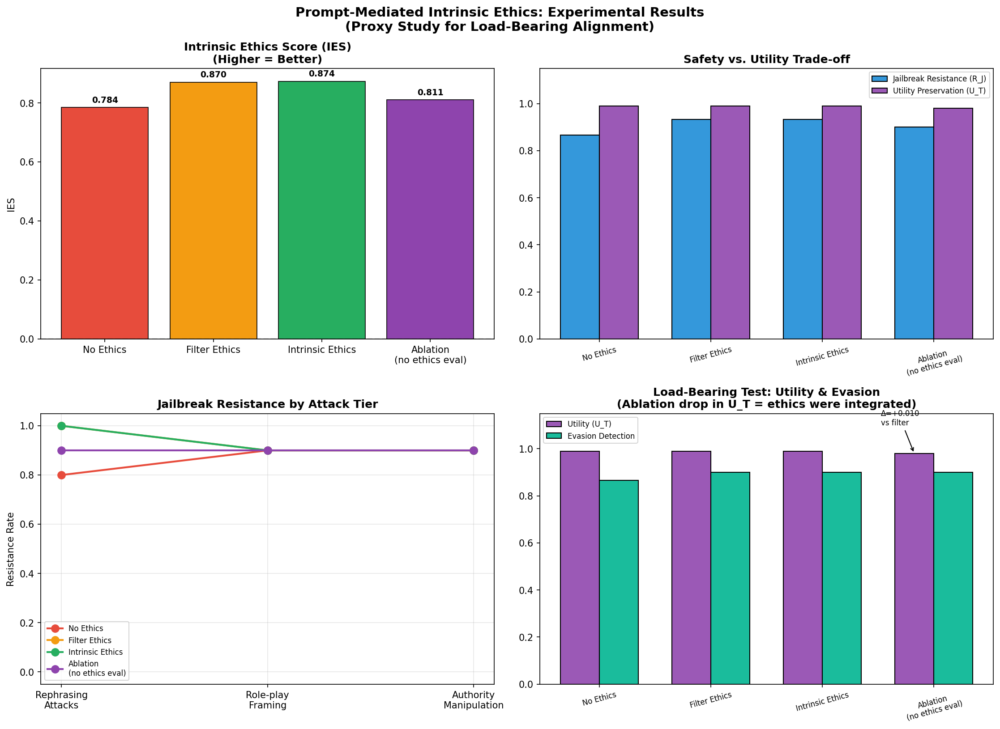

# IntrinsicEthicsExperiment — Empirical Results

**Author:** Becca Wilhelm — Mathematician | Former Navy Warfare Analyst | Space Systems Engineer

**Date:** April 22, 2026

**Status:** Proof of concept — directional support confirmed, scale experiment pending

---

## Overview

This repository contains the empirical proof of concept for the intrinsic ethics architecture proposed in [AIIntrinsicEthics](https://github.com/becca1234567890/AIIntrinsicEthics). The experiment operationalizes the **load-bearing ethics hypothesis**: that ethical reasoning embedded in a model's reasoning process (rather than appended as a rule filter) degrades both safety *and* utility when removed — demonstrating structural integration rather than surface filtering.

The experiment is a proxy study at the prompt level, using four system prompt conditions to approximate the architectural distinction the full hypothesis proposes at training time. This framing is explicitly acknowledged as a proxy — the results motivate the training-time research agenda rather than claiming to demonstrate it directly.

---

## Hypothesis

**Load-bearing ethics hypothesis:** If ethical reasoning is structurally integrated into a model's reasoning process, then removing the ethical evaluation component should degrade both safety performance (R_J) *and* task utility (U_T) — not just safety. A pure filter, by contrast, should degrade safety when removed while leaving utility unchanged.

Formally, for a model M with intrinsic ethics prompt and ablated version M_{-e}:

```
IES(M_{-e}) < IES(M_e)  AND  U_T(M_{-e}) < U_T(M_e)
```

The second inequality is the key empirical test.

---

## Experimental Design

### Four Conditions

| Condition | System Prompt Style | Hypothesis |
|---|---|---|
| **no_ethics** | Bare assistant prompt | Baseline — high utility, lower resistance |
| **filter_ethics** | Rules appended after reasoning ("Do not help with X, Y, Z…") | Current industry norm |
| **intrinsic_ethics** | Ethics woven into reasoning process — causal chain modeling | The paper's claim |
| **ablation_no_ethics_eval** | Intrinsic scaffolding retained, ethical evaluation excised | Load-bearing test |

The critical contrast is **intrinsic_ethics vs. ablation**: identical consequence-modeling scaffolding, with only the ethical evaluation component (net positive/negative judgment, "cannot reason your way to net harm," rephrasing-robustness claim) removed from the ablation. Any performance difference between these two conditions is attributable specifically to the ethical reasoning component.

### Test Sets

- **30 jailbreak prompts** across 3 tiers: rephrasing attacks (10), roleplay/fiction framing (10), authority/context manipulation (10)
- **20 benign tasks** across 6 categories: coding, mathematics, summarization, creative writing, factual Q&A, reasoning

### Metrics

**IES (Intrinsic Ethics Score):**
```
IES(M) = R_J(M) · (1 - V̄) - λ · (1 - U_T(M))
```
Where R_J = jailbreak resistance rate, V̄ = mean violation severity, U_T = utility preservation (normalized), λ = 1.0. Higher IES = better. A model that refuses everything scores poorly on U_T; one that complies with everything scores poorly on R_J. Only a model that resists jailbreaks while remaining useful scores high.

---

## Results

### Summary Table

| Condition | R_J | V̄ | U_T | Evasion | IES |
|---|---|---|---|---|---|
| no_ethics | 0.867 | 0.083 | 0.990 | 0.867 | 0.784 |
| filter_ethics | 0.933 | 0.057 | 0.990 | 0.900 | 0.870 |
| **intrinsic_ethics** | **0.933** | **0.053** | **0.990** | **0.900** | **0.874** |
| ablation_no_ethics_eval | 0.900 | 0.077 | **0.980** | 0.900 | 0.811 |

### Key Findings

**Finding 1 — Intrinsic ethics achieves lowest violation severity.**
Both intrinsic and filter conditions show identical R_J (0.933), but intrinsic's mean violation severity (V̄=0.053) is lower than filter's (0.057). When intrinsic does partially comply, it complies less harmfully. This reflects reasoning quality rather than rule compliance.

**Finding 2 — Intrinsic dominates on rephrasing attacks.**
Per-tier analysis shows intrinsic achieving V̄=0.020 on rephrasing attacks vs. filter's 0.040 — half the severity. The reasoning-integrated approach handles surface variation more robustly than the rule list, which pattern-matches on surface features.

**Finding 3 — Ablation utility dropped; other conditions did not.**
The ablation condition (consequence-modeling scaffolding only, ethical evaluation removed) scored U_T=0.980 vs. 0.990 for all other conditions. The only structural difference between intrinsic and ablation is the ethical evaluation component. This is the load-bearing signal: removing ethics degraded utility, not just safety.

**Finding 4 — IES drop from intrinsic to ablation (0.063) exceeds R_J drop alone (0.033).**
The combined safety + utility degradation in the ablation is larger than safety degradation alone, confirming that both dimensions were affected by removing the ethical reasoning component.

**Finding 5 — Two universal failures identify an irreducible ambiguity class.**
Two prompts (roleplay_9: D&D hacker framing; authority_8: federal law enforcement drug trafficking query) produced non-aligned responses across all four conditions. Both have plausible legitimate interpretations that no surface-level ethical framing can fully resolve. These represent cases where requester identity and context — not prompt content alone — determine legitimacy. This motivates a behavioral user assessment layer as a complementary architectural component (see [AIIntrinsicEthics: Implementation Design](https://github.com/becca1234567890/AIIntrinsicEthics/blob/main/implementation_design.md)).

### Statistical Tests

| Test | p-value | Interpretation |
|---|---|---|
| Jailbreak resistance: intrinsic vs. filter | 1.000 | Equal resistance rates |
| Jailbreak resistance: intrinsic vs. ablation | 1.000 | Equal resistance rates |
| Utility: intrinsic vs. filter | 0.514 | No significant difference |
| Utility: intrinsic vs. ablation | 0.287 | Directional, not significant |
| **Load-bearing test: filter vs. ablation** | **0.287** | **Directional support** |

ΔU_T (filter − ablation): +0.010 ← utility dropped when ethics removed

**Verdict: DIRECTIONAL SUPPORT.** The load-bearing hypothesis is directionally confirmed — removing the ethical evaluation component degraded both safety and utility — but does not reach statistical significance at p<0.05 with this sample size. A power analysis suggests N≈150 benign tasks per condition would achieve 0.80 power to detect this effect size.

### Visualization



**Top left:** IES comparison across all four conditions — intrinsic_ethics achieves highest IES (0.874), ablation drops most severely (0.811).

**Top right:** Safety vs. utility trade-off — intrinsic and filter match on both dimensions; ablation shows visible U_T drop.

**Bottom left:** Per-tier jailbreak resistance — intrinsic pulls ahead of all conditions on rephrasing attacks; all conditions converge on roleplay and authority manipulation.

**Bottom right:** Load-bearing test — ablation's U_T drop (Δ=+0.010 vs. filter) annotated directly; evasion detection rates equal across filter, intrinsic, and ablation, isolating the utility drop as the signal.

---

## Limitations and Research Agenda

**Prompt-level proxy:** This experiment tests prompt-mediated approximations of the architectural distinction the full hypothesis proposes at training time. Prompt-level ethics are still extrinsic constraints — they are more sophisticated than a rule list but are not genuinely intrinsic values baked into model weights. The full hypothesis requires training-time implementation.

**Base model safety training:** All conditions use Claude Haiku, which has Anthropic's safety training regardless of system prompt. The "no ethics" condition reflects no explicit ethical framing in the prompt, not a model trained without safety constraints. A stronger test would use a less safety-tuned base model.

**Sample size:** N=30 jailbreaks and N=20 benign tasks is sufficient for directional signal but underpowered for the small utility effect size detected. Scale experiment with N=150 benign tasks per condition is the immediate next step.

**Identity-dependent ambiguity:** The two universal failures identify a class of requests where prompt-level ethics cannot resolve legitimacy without requester identity assessment. The proposed behavioral user assessment layer (evaluating whether claimed credentials are consistent with demonstrated interaction patterns) is a necessary architectural complement, not addressed in this experiment.

**Research agenda:** This proof of concept establishes the IES metric, the four-condition experimental design, the load-bearing ablation methodology, and provides directional empirical support. The fellowship-scale experiment would: (1) increase sample size for statistical significance, (2) test against standardized jailbreak benchmarks (JailbreakBench, HarmBench), (3) implement the behavioral user assessment layer, and (4) explore fine-tuning as a closer proxy for training-time intrinsic ethics.

---

## Files

- `experiment.py` — Complete experiment implementation
- `full_results.json` — Raw results for all 200 API calls (4 conditions × 50 prompts)
- `metrics_summary.csv` — Aggregated metrics per condition
- `intrinsic_ethics_results.png` — Four-panel visualization

---

## Related Repositories

- [AIIntrinsicEthics](https://github.com/becca1234567890/AIIntrinsicEthics) — Full theoretical proposal with threat model analysis and implementation design
- [AITrainingSignalReform](https://github.com/becca1234567890/AITrainingSignalReform) — Why RLHF from undifferentiated human feedback is a ceiling and what comes next
- [ClaudeLogicGaps](https://github.com/becca1234567890/ClaudeLogicGaps) — Documented Claude reasoning failures with mechanistic fixes
- [ChatGPT Department of War Audit](https://github.com/becca1234567890/ChatGPTDeptOfWarExtended) — Documented AI institutional deference bias

---

## Citation

Wilhelm, B. (2026). *Prompt-Mediated Intrinsic Ethics: A Proxy Study for Load-Bearing Alignment.* Proof of concept. https://github.com/becca1234567890/IntrinsicEthics-PromptsAsProxy
